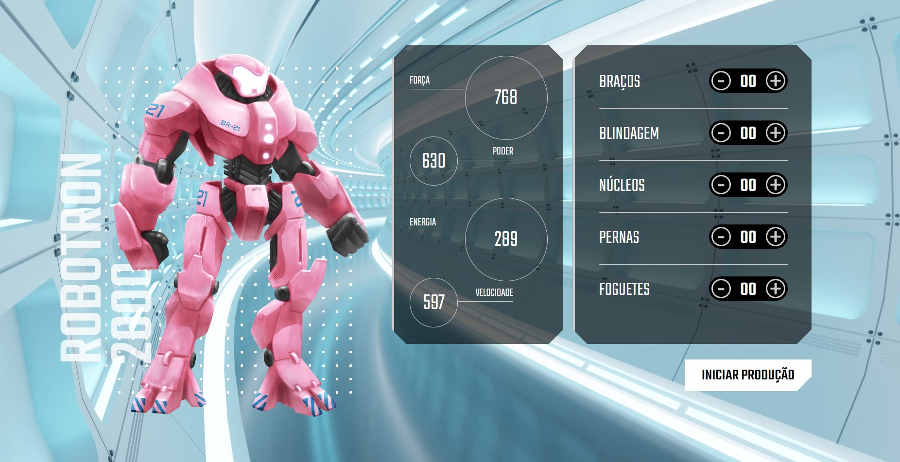

<h1 align="center">Projeto: Robotron 2000</h1>

<h2 align="center">Sobre o projeto :dart:</h2>

 Curso da formação de JavaScript para o Front-End - Alura <b>JavaScript: manipulando o DOM</b>

Aprender a manipular elementos na árvore do DOM, interagir com HTML por meio do JavaScript, criar funções e operações lógicas.

<h2 align="center">Tecnologias utilizadas :hammer_and_wrench:</h2> 

<h2 align="center"> Print do projeto </h2>

<h2 align="center"> Contributor :woman_technologist:</h2>
<table align="center">
<tbody>
<tr>
<td align="center">
 <b>Lílian Rangel</b>
 

</td>
</tr>
</tbody>
</table>
